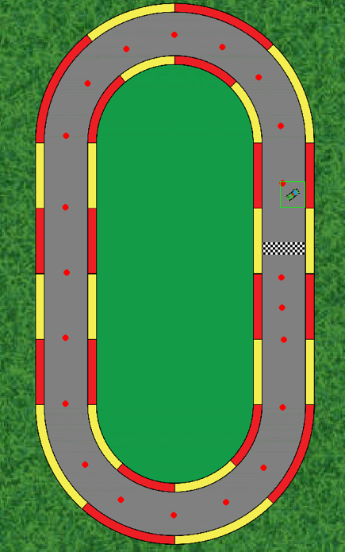
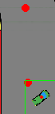
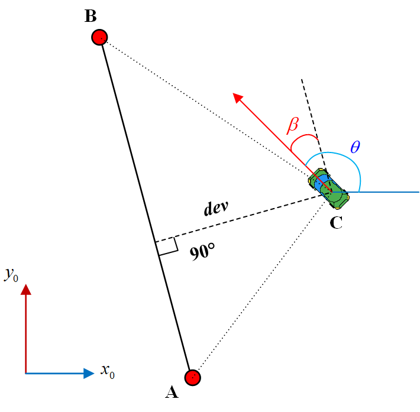
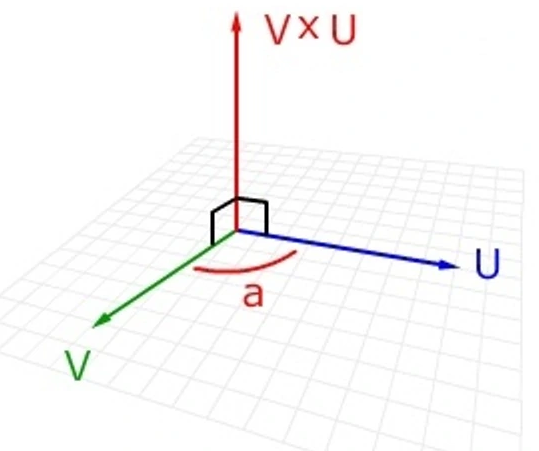

本项目通过python构建了一个简单的自动驾驶车辆环境，车辆动力学灵感来自于[techwithtim/Pygame-Car-Racer: Make a racing game in Python using pygame! (github.com)](https://github.com/techwithtim/Pygame-Car-Racer)，您也可以在YouTube上敢看他的视频进行学习：[(25) Pygame Car Racing Tutorial #1 - Moving The Car - YouTube](https://www.youtube.com/watch?v=L3ktUWfAMPg)

感谢techwithtim！

运行本项目前，请先根据`requiremens.txt`配置好python解释器，非常简单！

```
pip install -r requirements.txt
```

运行`DQN_CAR.py`文件，即可使用DQN算法驱动小车。



**状态设置：**





根据余弦定理，可以求得小车相对于两点构成的中线的偏移量与夹角(我们选取质心侧偏角β角作为状态之一)。

并且，通过三维向量的叉乘判断小车相对于中线的位置（左、右）



当 VxU>0，则从V到U为顺时针，以此类推。

并且，可以在动力学文件`autocar.py`中进行其他相关设置，比如在`ComputerCar.__get_rewards()`中设置奖励！

如果您喜欢这个项目，点击star收藏！😁😁😁
